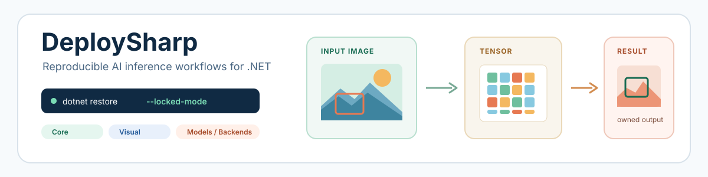

<picture>
  <source media="(prefers-color-scheme: dark)" srcset="docs/images/readme/hero-dark.svg">
  <source media="(prefers-color-scheme: light)" srcset="docs/images/readme/hero-light.svg">
  
</picture>

面向 .NET 的模块化模型部署工具，为视觉、语言和多模态模型提供可复现、可替换后端的推理工作流。

  
  
  
  
  

  
  
  

<a href="README.md">English</a> | <strong>简体中文</strong>

# DeploySharp

DeploySharp V2 为模型工件、类型化张量、Session、视觉流程、语言/多模态工作流、ModelPack 完整性、ModelFactory 获取和可替换推理后端提供明确契约。应用负责模型文件和原生运行时，DeploySharp 让后端选择与执行边界保持可见。

## 📖 项目介绍

- **稳定的应用契约：**模型身份、类型化张量、命名输入/输出、Session、诊断、取消和释放。
- **完整推理工作流：**分类、检测、分割、姿态、OBB、OCR、异常、提示分割、视觉语言、LLM 和多模态路径。
- **显式后端所有权：**ONNX Runtime、OpenVINO、OpenCV DNN、TensorRT/CUDA 和 LLamaSharp 适配器，不会静默安装全部厂商运行时。
- **可复现模型交付：**ModelPack 清单、工件大小/SHA-256 校验、不可变 Release 下载、离线缓存复用，以及可运行的模型案例。

V2 是全新 API 设计，不提供 V1 的源码、二进制、配置或行为兼容。

## ✨ 版本亮点

- Core、Visual、LLM、Multimodal、ModelPack、ModelFactory、五类后端和七个分组示例模块。
- 模型目录、后端验证矩阵和具名设备性能数据均以独立公开文档维护。
- Windows x64 上已完成 ONNX Runtime、OpenVINO、OpenCV DNN 与具名 TensorRT/CUDA 环境验证。
- 支持会话池、批处理、视觉异步推理、滑动窗口检测和可复现实测工具。

## 📢 当前更新：2.0.0-alpha.1

<code>2.0.0-alpha.1</code> 是 DeploySharp V2 的首次工程预览版。目前以 Windows 10/11 x64 源码复现为主，公共 API 和包边界仍会继续调整。首发范围和已知边界见 [2.0.0-alpha.1 发布说明](docs/releases/2.0.0-alpha.1.md)。

## 🚀 30 秒开始

安装 Core 与所需后端包，源码复现时可直接使用本仓库项目引用：

~~~powershell
dotnet add package JYPPX.DeploySharp.Core --version 2.0.0-alpha.1
dotnet add package JYPPX.DeploySharp.Backend.OnnxRuntime --version 2.0.0-alpha.1
dotnet add package Microsoft.ML.OnnxRuntime --version 1.28.0
~~~

创建模型工件、注册 ONNX Runtime、建立命名张量 Session，并执行一次类型化输入：

~~~csharp
using System.Threading;
using JYPPX.DeploySharp;
using JYPPX.DeploySharp.Backends.OnnxRuntime;
using JYPPX.DeploySharp.Models;
using JYPPX.DeploySharp.Registry;
using JYPPX.DeploySharp.Tensors;

using var backends = new BackendRegistry();
backends.UseOnnxRuntime();

var artifact = new ModelArtifact(
    new ModelId("examples/classifier"),
    "onnx",
    @"models\classifier.onnx",
    preferredBackend: OnnxRuntimeBackendProvider.BackendId);
using IInferenceSession session = backends.CreateSession(
    artifact,
    new BackendRequest(BackendCapabilities.TensorInference,
        OnnxRuntimeBackendProvider.BackendId, "cpu"),
    SessionOptions.Default);

var input = new Tensor<float>(new TensorShape(1, 3), new[] { 0.1f, 0.2f, 0.7f });
InferenceOutputs outputs = session.Run(InferenceInputs.Create("images", input), CancellationToken.None);
Console.WriteLine(outputs.Count);
~~~

完整的代码路径、视觉准备、ModelFactory 下载流程和模型案例见[使用教程](docs/articles/usage-tutorial.md)及 [samples](samples/README.md)。

## 📦 包结构

| 包族 | 内容 | 原生运行时所有权 |
| --- | --- | --- |
| <code>JYPPX.DeploySharp.Core</code> | 模型、张量、Session、结果、诊断、后端注册 | 无 |
| <code>JYPPX.DeploySharp.Visual</code> | 视觉 Profile、预处理元数据、解码器、规范化结果 | 无 |
| <code>JYPPX.DeploySharp.Visual.OpenCV</code> | OpenCV 图像读取和张量准备 | 应用选择 OpenCV runtime |
| <code>JYPPX.DeploySharp.Visual.TensorRT</code> | CUDA 前处理与设备驻留 TensorRT 视觉流水线 | 应用提供 TensorRT、CUDA、bridge 和 engine |
| <code>JYPPX.DeploySharp.LLM</code> / <code>Multimodal</code> | 生成、对话、Embedding、有序媒体、流式 | 应用选择模型运行时 |
| <code>JYPPX.DeploySharp.ModelPack.Json</code> / <code>ModelFactory</code> | 清单、完整性校验、目录下载、离线缓存 | 无，模型文件由应用持有 |
| <code>JYPPX.DeploySharp.Backend.*</code> | ONNX Runtime、OpenVINO、OpenCV DNN、TensorRT、LLamaSharp 适配器 | 按后端显式选择 |

## 🌐 公共包与 Release 资产

DeploySharp 包尚未发布到 nuget.org。以下保留准确的包 ID 和 `2.0.0-alpha.1` 候选版本；每个 NuGet 徽章直接指向真实包页，首次发布后会自动显示线上版本，无需再次修改 README。

| 包 | 候选版本 | NuGet.org | 用途 |
| --- | --- | --- | --- |
| `JYPPX.DeploySharp.Core` | `2.0.0-alpha.1` |  | Core 契约和后端注册 |
| `JYPPX.DeploySharp.Visual` | `2.0.0-alpha.1` |  | 视觉 Profile、预处理和解码器 |
| `JYPPX.DeploySharp.Visual.OpenCV` | `2.0.0-alpha.1` |  | OpenCV 图像准备 |
| `JYPPX.DeploySharp.Visual.TensorRT` | `2.0.0-alpha.1` |  | CUDA 前处理和 TensorRT 视觉流水线 |
| `JYPPX.DeploySharp.LLM` | `2.0.0-alpha.1` |  | LLM 生成与 Embedding 契约 |
| `JYPPX.DeploySharp.Multimodal` | `2.0.0-alpha.1` |  | 有序多模态编排 |
| `JYPPX.DeploySharp.ModelPack.Json` | `2.0.0-alpha.1` |  | 模型清单和完整性校验 |
| `JYPPX.DeploySharp.ModelFactory` | `2.0.0-alpha.1` |  | 目录选择、下载、缓存和离线复用 |
| `JYPPX.DeploySharp.Backend.OnnxRuntime` | `2.0.0-alpha.1` |  | ONNX Runtime 命名张量适配器 |
| `JYPPX.DeploySharp.Backend.OpenVINO` | `2.0.0-alpha.1` |  | OpenVINO 命名张量适配器 |
| `JYPPX.DeploySharp.Backend.OpenCV` | `2.0.0-alpha.1` |  | OpenCV DNN 适配器 |
| `JYPPX.DeploySharp.Backend.TensorRT` | `2.0.0-alpha.1` |  | TensorRT 推理和 ONNX 转 Engine 边界 |
| `JYPPX.DeploySharp.Backend.LlamaSharp` | `2.0.0-alpha.1` |  | LLamaSharp GGUF 生成和 Embedding |

| 发布渠道 | 当前状态 | 资产 |
| --- | --- | --- |
| [NuGet.org](https://www.nuget.org/) | DeploySharp 包待首次发布 | 公共托管包源 |
| [GitHub Packages](https://github.com/guojin-yan/DeploySharp/packages) | DeploySharp 包待首次发布 | 包镜像 |
| [GitHub Releases](https://github.com/guojin-yan/DeploySharp/releases) | 当前用于模型工件交付 | 不可变 ModelPack 资产和验证元数据 |

### 应用负责的运行时包

以下是 Windows Alpha 使用的应用依赖/运行时包，不会因引用 DeploySharp 托管包而被静默安装：

| 包 | NuGet | 作用 |
| --- | --- | --- |
| [Microsoft.ML.OnnxRuntime](https://www.nuget.org/packages/Microsoft.ML.OnnxRuntime/) |  | ONNX Runtime CPU 原生执行 |
| [JYPPX.OpenCV.runtime.win-x64](https://www.nuget.org/packages/JYPPX.OpenCV.runtime.win-x64/) |  | Windows x64 OpenCV 原生运行时 |
| [OpenVINO.runtime.win](https://www.nuget.org/packages/OpenVINO.runtime.win/) |  | Windows OpenVINO 原生运行时 |
| [JYPPX.TensorRT.CSharp.API](https://www.nuget.org/packages/JYPPX.TensorRT.CSharp.API/) |  | 托管 TensorRT/CUDA API；NVIDIA 库仍由用户安装 |
| [LLamaSharp.Backend.Cpu](https://www.nuget.org/packages/LLamaSharp.Backend.Cpu/) |  | LLamaSharp GGUF 工作流的 CPU 原生后端 |

托管包表格不代表自动安装原生依赖。选择部署 RID 前请阅读[安装和运行时所有权说明](docs/articles/installation.md)。

## 🖥️ 平台与目标框架

| 平台 | 构建/包边界 | 推理验证 |
| --- | --- | --- |
| Windows 10 x64 | Alpha 支持 | ONNX Runtime、OpenVINO、OpenCV DNN CPU；具名 TensorRT GPU 证据 |
| Windows 11 x64 | Alpha 支持 | 同一代码路径；具名设备证据单独记录 |
| Windows ARM64、Linux、macOS、移动端、NPU | 无 Alpha 推理声明 | 本版本尚未验证 |

完整框架列表和后端证据见[平台与后端支持](docs/articles/platform-support.md)。可构建不等于已完成推理验证。

## 🤖 支持的模型

模型目录覆盖 YOLO、DETR、PaddleOCR v4/v5/v6、PaDiM、BRIA RMBG、SAM、CLIP、BLIP 和 Qwen GGUF。目录 ID 与当前状态见[模型支持指南](docs/articles/model-support.md)，每个模型/后端组合见[模型/后端验证矩阵](docs/model-backend-verification-matrix.md)。

## 🧪 示例系列

| 模块 | 演示内容 |
| --- | --- |
| <code>01-core</code> | 后端无关的模型/张量生命周期 |
| <code>02-visual</code> | 视觉 Profile、预处理元数据、异步推理与滑动窗口检测 |
| <code>03-backends</code> | 原生后端加载和命名张量执行 |
| <code>04-multimodal</code> | 有序媒体、流式、取消和清理 |
| <code>05-llm</code> | 对话历史和提示词格式化 |
| <code>06-models</code> | 目录选择、模型案例、Release 下载/推理 |
| <code>07-benchmarks</code> | 同模型后端/平台延迟和吞吐 |

详见[示例学习路径](samples/README.md)。

## 📚 文档

| 资源 | 链接 | 说明 |
| --- | --- | --- |
| 文档索引 | [docs/index.md](docs/index.md) | DocFX 公开文档入口 |
| 首次版本说明 | [2.0.0-alpha.1](docs/releases/2.0.0-alpha.1.md) | 首发范围和已知边界 |
| 使用教程 | [使用教程](docs/articles/usage-tutorial.md) | 代码优先的张量和视觉工作流 |
| 平台/后端支持 | [支持表](docs/articles/platform-support.md) | 目标框架和验证边界 |
| 模型支持 | [模型指南](docs/articles/model-support.md) | 目录 ID、模型族和状态语义 |
| 设备性能实测 | [具名设备结果](docs/articles/device-performance-benchmarks.md) | 可复现的环境与耗时记录 |

## 🔨 源码构建

~~~powershell
dotnet restore DeploySharp.sln --locked-mode
dotnet build DeploySharp.sln -c Release --no-restore
dotnet test DeploySharp.sln -c Release --no-build --no-restore
~~~

## ⚖️ 许可证

DeploySharp 源码采用 [Apache License 2.0](LICENSE.txt) 许可证。模型和厂商运行时属于独立工件，分别遵循其运行时和分发条款。

## 📮 联系与赞助

如果你有使用问题、Issue、测试反馈或赞助意愿，欢迎通过项目主页和 Issue 区与我们联系。

  

---

## ⚠️ 软件声明与免责声明

### 📜 1. 开源协议声明

作者所有开源项目代码均遵循 **Apache License 2.0** 开源协议。

*特别说明：本项目集成了若干第三方库。若任何第三方库的许可协议与 Apache 2.0 协议存在冲突或不一致，均以该第三方库的原始许可协议为准。本项目不包含也不代表这些第三方库的授权声明，使用前请务必阅读并遵守第三方库的相关许可。*

### 🤖 2. 代码开发与质量说明

- **AI 辅助开发**：本代码在开发过程中使用了人工智能（AI）辅助生成与优化，并非完全由人工逐行编写。
- **安全性承诺**：**作者郑重声明，本代码中绝无任何有意设置的后门、病毒、木马或旨在破坏用户设备、窃取数据的恶意代码。**
- **技术局限性**：受限于作者个人的技术水平与能力，代码中可能存在因逻辑不严谨、优化不足或经验欠缺导致的低级问题（例如但不限于内存泄漏、偶发崩溃、资源未释放等）。这些问题纯属能力不足所致，并非主观故意。
- **测试范围**：由于作者精力有限，未对本软件进行全方位、覆盖所有边缘场景的完整测试。

### 🚨 3. 免责声明（重要）

**请在将本代码应用于任何实际项目（特别是商业、工业或关键任务环境）之前，务必进行详尽、严格的自行测试与验证。** 鉴于上述可能存在的代码缺陷及测试覆盖不足，**因使用本代码而导致的任何直接或间接损失（包括但不限于设备故障、数据丢失、系统瘫痪或利润损失等），本作者概不负责。** 一旦您开始使用本代码，即表示您已知晓上述风险并同意自行承担一切后果，相关问题与本作者无关。

### 🔓 4. 代码开源范围

本项目承诺核心逻辑代码完全开源，但上述提到的“第三方库”的二进制文件、源代码或相关资源不在本项目的开源义务范围内，请根据其各自的指引获取。

### 🤝 5. 社区与反馈

尽管存在上述不足，我们仍欢迎大家下载使用、提交 Issue 或参与测试，共同完善项目。如果你在使用过程中发现 Bug、内存溢出或有改进建议，欢迎通过项目主页提供的联系方式与作者取得联系，我们将尽力在有限的时间内提供协助。
